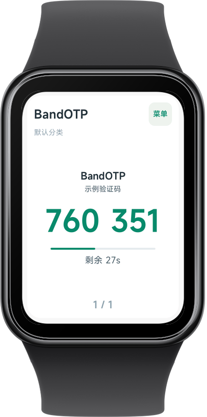
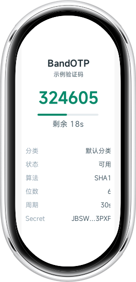

<p align="center">
  
</p>

<h1 align="center">BandOTP</h1>

<p align="center">在小米手表上离线查看 TOTP 动态验证码的 Vela 快应用。</p>

<p align="center">
  <a href="#功能">功能</a> |
  <a href="#使用方法">使用方法</a> |
  <a href="#开发与构建">开发与构建</a> |
  <a href="#安全说明">安全说明</a>
</p>

## 简介

BandOTP（应用名：腕码）是一个运行在小米手表上的 TOTP（Time-based One-Time Password，基于时间的一次性密码）验证码查看器。它从配套安卓端接收 MFA 配置，在手表本地计算验证码；日常查看验证码时不依赖网络连接。

项目基于 [Xiaomi Vela 快应用](https://iot.mi.com/vela/quickapp) 开发，当前包名为 `asia.bilibili.mfa`，最低平台版本为 `1000`。

> 本仓库仅包含手表端快应用。安卓端负责管理 MFA Secret 并向手表同步配置，不包含在本项目中。
<p align="center">
  
  
</p>
## 功能

- 本地生成基于 SHA-1 的 TOTP 动态验证码。
- 每秒刷新验证码与剩余有效时间。
- 支持 6 位或 8 位验证码，以及 15 至 120 秒的刷新周期。
- 支持按分类浏览多个账号，每页显示 3 个验证码。
- 支持查看账号、分类、算法、位数、周期和脱敏后的 Secret 等详情。
- 通过 `system.interconnect` 与手机端同步配置，并持久化到手表本地存储。
- 手机断开后，已同步的验证码仍可离线使用。

## 使用方法
从AstroBox下载

<a href="https://astrobox.online/open?source=res&res=asia.bilibili.mfa&provider=official" target="_blank" rel="noopener noreferrer">
  
</a>

### 1. 安装应用

从 [Releases](../../releases) 下载构建产物 `.rpk`，或按下文的构建步骤自行生成，然后使用支持 Xiaomi Vela 快应用的工具安装到手表。

### 2. 在安卓端配置并同步
安卓端： [BandOTP](https://github.com/lin945/mi_band_mfa_android.git)

在配套安卓端新增或编辑 MFA/TOTP 账号，再将配置同步到手表。手表端接收的配置快照结构如下：

```json
{
  "type": "mfa_config_snapshot",
  "version": 1,
  "sentAt": 1760000000000,
  "configs": [
    {
      "id": "github-example",
      "issuer": "GitHub",
      "accountName": "name@example.com",
      "category": "开发",
      "secret": "BASE32SECRET",
      "digits": 6,
      "period": 30,
      "updatedAt": 1760000000000
    }
  ]
}
```

字段说明：

| 字段 | 必填 | 说明 |
| --- | --- | --- |
| `id` | 否 | 账号唯一标识；缺失时应用自动生成。 |
| `issuer` | 否 | 服务名称，例如 `GitHub`。 |
| `accountName` | 否 | 账号名称或邮箱。 |
| `category` | 否 | 分类名称；缺失时归入“默认分类”。 |
| `secret` | 是 | Base32 编码的 TOTP Secret。 |
| `digits` | 否 | 验证码位数，仅支持 6 或 8，默认 6。 |
| `period` | 否 | 刷新周期，范围为 15 至 120 秒，默认 30 秒。 |
| `updatedAt` | 否 | 配置更新时间戳。 |

### 3. 在手表上查看验证码

1. 打开 BandOTP，等待页面显示“已同步”或“已连接手机”。
2. 使用分类两侧的按钮切换分类。
3. 使用分页两侧的按钮浏览同一分类下的账号。
4. 点击账号卡片查看详情；在详情页右滑返回。

## 开发与构建

### 环境要求

- Node.js `>= 8.10`。
- npm。
- 支持 Vela 快应用开发、调试和安装的环境或设备。

### 安装依赖

```bash
npm install
```

### 本地开发

```bash
npm run start
```

该命令会以 watch 模式启动 `aiot` 开发流程。

### 构建与发布包

```bash
npm run build
npm run release
```

构建产物位于 `dist/` 目录，发布命令生成可安装的 `.rpk` 包。

### 代码检查

```bash
npm run lint
```

项目已配置 Prettier、ESLint、Stylelint 和 Husky。首次启用 Git 提交前检查时，可执行：

```bash
sh husky.sh
```

Windows PowerShell 环境可执行：

```powershell
./husky.sh
```

## 项目结构

```text
src/
├── app.ux                         # 应用入口
├── manifest.json                  # 快应用元信息与页面路由
├── common/
│   ├── logo.png                   # 应用 Logo
│   └── scripts/
│       ├── totp.js                # TOTP 与 SHA-1 实现
│       └── mfaConfig.js           # 配置校验、本地存储与同步快照解析
└── pages/
    ├── index/                     # 验证码列表、分类和分页
    ├── detail/                    # 单个账号详情
    └── copyright/                 # 版权与赞助信息
```

## 安全说明

- TOTP Secret 是高敏感凭据，获得 Secret 的人可在其有效期内生成验证码。请只在可信设备和可信传输链路中同步配置。
- 本应用会将已同步配置保存到手表本地存储，以便离线生成验证码。清除应用数据或卸载应用会移除本地配置。
- 手表端仅显示脱敏后的 Secret，但代码和本地存储中仍需保存完整 Secret 才能计算验证码。
- 请为手机和手表启用锁屏保护；设备丢失、转交或维修前，应清除应用数据和 MFA 配置。
- 本项目当前使用 SHA-1 TOTP。部分服务可能要求不同算法，使用前请确认服务端兼容性。

## 贡献

欢迎通过 Issue 和 Pull Request 提交问题、改进建议或代码。提交前请至少运行：

```bash
npm run lint
npm run build
```

## 致谢

- [Xiaomi Vela](https://iot.mi.com/vela/quickapp) 提供快应用运行与开发能力。
- [RFC 6238](https://www.rfc-editor.org/rfc/rfc6238) 定义 TOTP 算法规范。
- [Codex](https://openai.com/zh-Hans-CN/codex/) 提供的Vibe coding协助。

